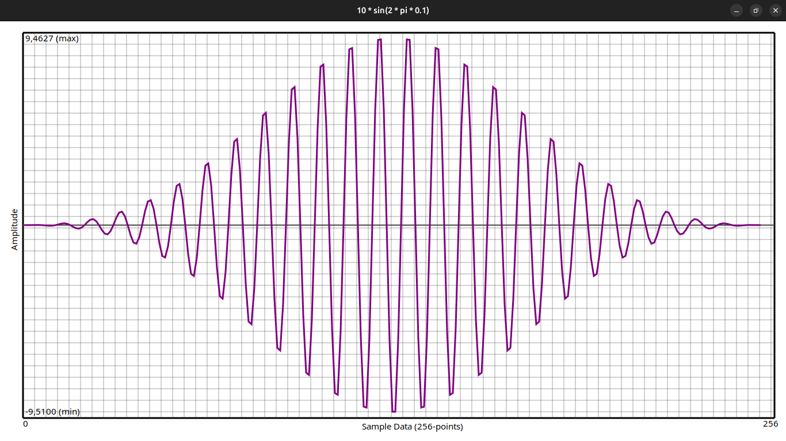

# Digital Signal Processing 

This library is indeed to provide digital signal processing interface. Primarilly, 
this library consists of nine modules. In future, of course, I'll develop new modules. 
For now, these modules are `time`, `freq`, `filter`, `signal`, `transform`, `plot`. 
`arrival`, `beaform` and `window`. 

To use the plotting functionality and arrival of angle algorithm, there are especially
two libraries that you must have. These are `GTK4` and `GSL` (GNU Scientific Library).
You can installed these with:

```shell
$ sudo apt install libgtk-4-dev libgsl-dev
```

Generally, the all sample/data structures are defined with fixed-side buffer named
`DATA_SIZE` due to real-time & deterministic requirements. You MUST set it according to 
your considerations. 

Time-domain and frequency domain data structures are defined seperated named `DspTime`
and `DspFreq`. Also there are the other structures for specific usages. 

Also I put the some example programs under `/examples` directory. For example, let's
consider this program:

```c

#include "dsp.h"

int main(void)
{
	DspTime sample, windowed;
	DspPlot plot;
	DspStatus status;
	int res;

	/* Create a windowed sinus sample. */
	status = dsp_signal_sin(10, 100, 1000, 0, 256, &sample);
	assert(status == DSP_SUCCESS);

	/* Window it. */
	status = dsp_window_blackman(&sample, &windowed);
	assert(status == DSP_SUCCESS);

	/* Plot the windowed sample. */
	plot.title = "10 * sin(2 * pi * 0.1)";
	plot.color = DSP_COLOR_PURPLE;
	plot.width = 3.0;
	plot.sample = &windowed;

	res = dsp_plot_sample(&plot);
	assert(res == 0);

	return EXIT_SUCCESS;
}
```

After run this program you will see this plot:


